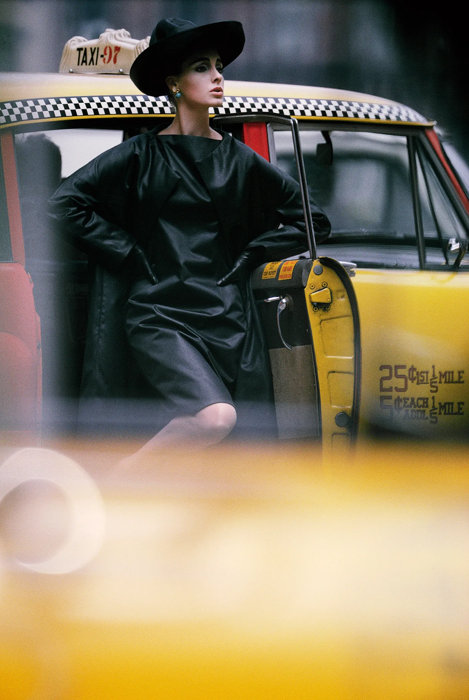
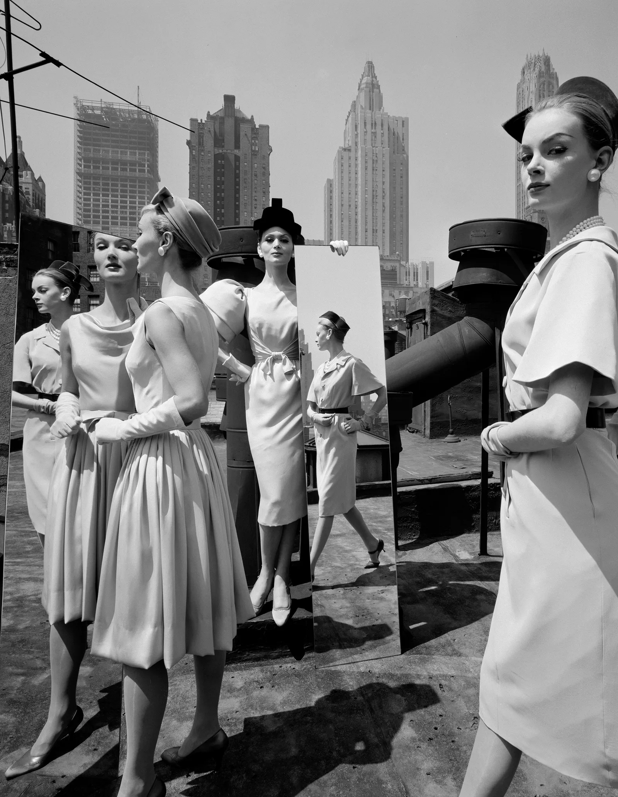
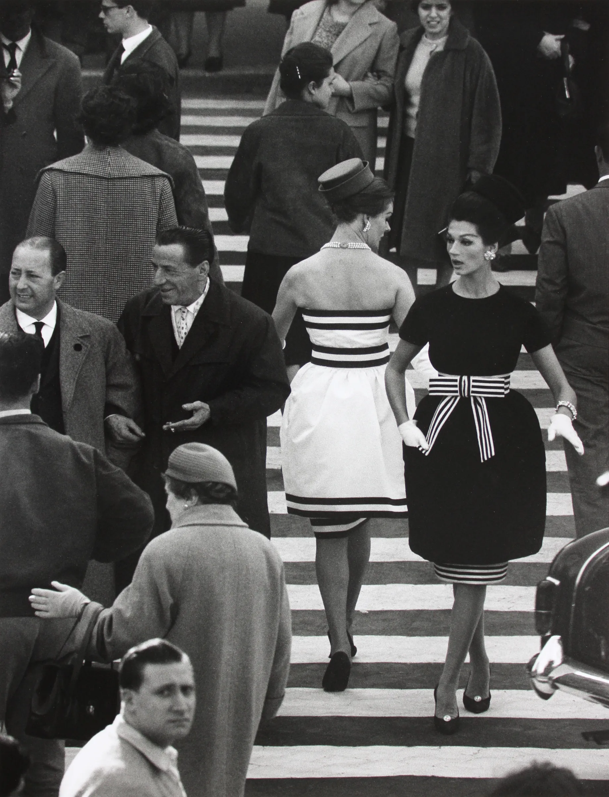
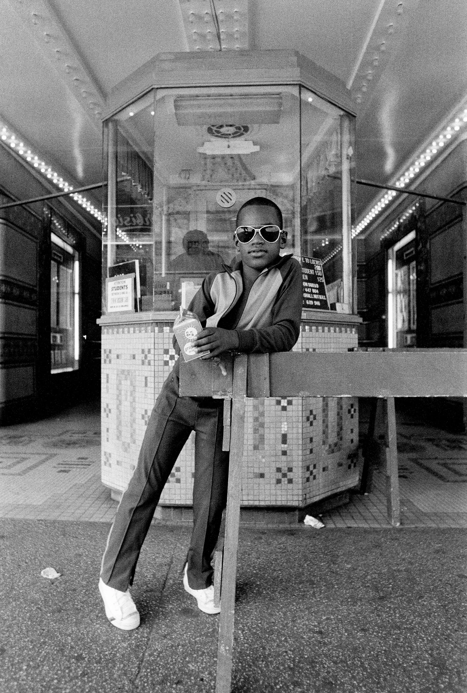
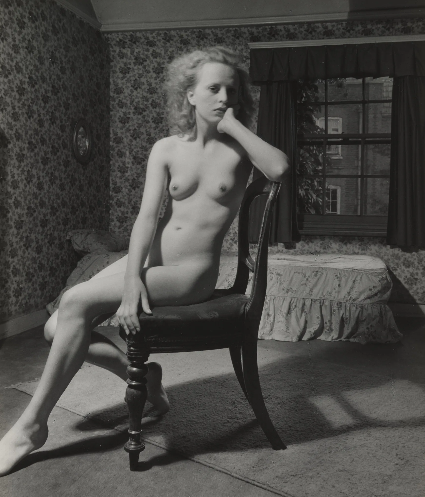
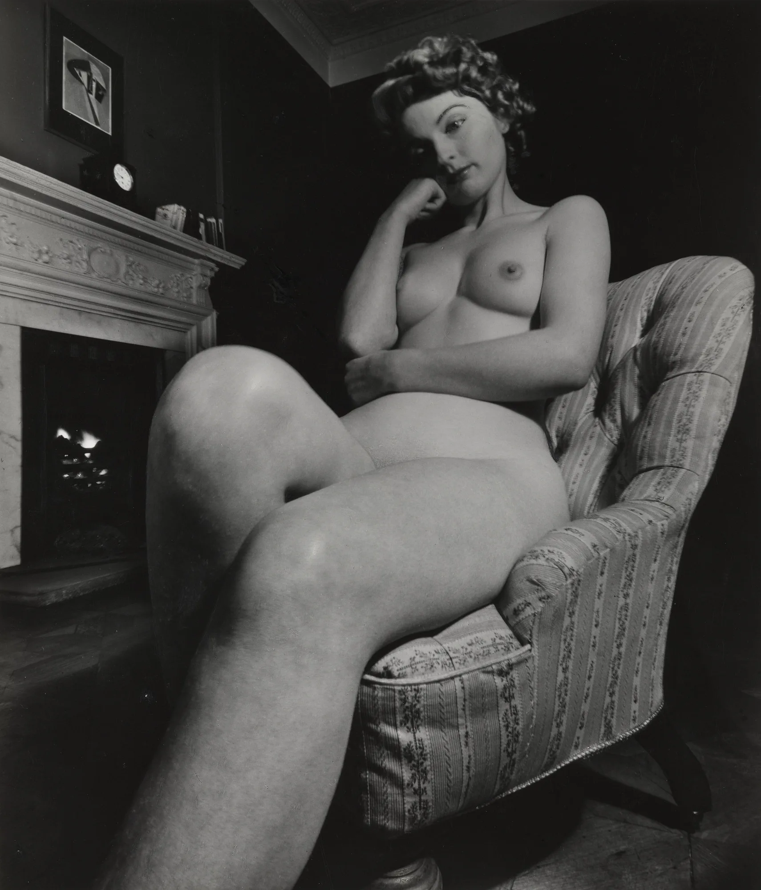

### PUPH 2101

## Core Studio 1: Digital Practices

 
    
<bold-title>Optics</bold-title>

<slide-footer>

  ## Shabtai Pinchevsky

</slide-footer>

---
layout: center
---

<bold-title>Table of Content</bold-title>

<v-clicks>

- Focal Lengths
- Zoom vs Primes
- Aperture and Depth of Field
- Lens Quality and Optical Aberrations

</v-clicks>

---
layout: image
image: ./images/canon-rf-35mm-1,4.webp
---

---
layout: image
image: ./images/focal-length.webp
scale: 80
---

---
layout: center
width: 60
---

<bold-title>Focal Length determines the Angle of View</bold-title>

<v-clicks>

**Shorter** focal lengths (15mm) = **WIDER** angle of view

**Longer** focal lengths (200mm) = **NARROWER** angle of view

</v-clicks>

---
layout: image
image: ./images/red-barn-sequence.webp
---

---
layout: two-cols
---

::right::

<slide-footer>
William Klein, American, 1926-2022
</slide-footer>

---
layout: two-cols
---

::right::

<slide-footer>
William Klein, American, 1926-2022
</slide-footer>

---
layout: two-cols
---

::right::

<slide-footer>
Dawoud Bey, American, born 1953
</slide-footer>

---
layout: two-cols
---

::right::

<slide-footer>
Bill Brandt, British, 1904-1983
</slide-footer>

---
layout: two-cols
---

::right::

<slide-footer>
Bill Brandt, British, 1904-1983
</slide-footer>

---
layout: image
image: ./images/canon-rf-25-105-4.webp
---

---
layout: image
image: ./images/canon-rf-35mm-1,4.webp
---

---
layout: two-cols
---
<bold-title>Zoom Lenses</bold-title>

<v-clicks>

Cover a range of focal lengths

A single lens instead of many

</v-clicks>

::right::

<bold-title>Prime Lenses</bold-title>

<v-clicks>

Often can be smaller in size

Offer larger maximum apertures

- Better low light performance
- Better depth of field control

Offer better optical quality

Committing the photographer to a single focal length

</v-clicks>

---
layout: center
---

<bold-title>Maximum Aperture</bold-title>

---
layout: image
image: ./images/canon-rf-25-105-4.webp
---

---
layout: image
image: ./images/canon-rf-35mm-1,4.webp
---

---
layout: default
---

<bold-title>Maximum Aperture</bold-title>

<v-clicks>

The maximum aperture supported by a lens, will be listed in its name.

- - - 

The maximum aperture determines the maximum amount of light the lens can expose.

- - -

A bigger aperture will also result in greater depth of field (blurring the background).

- - - 

It is common for high-quality zoom lens to have f/4 or f/2.8 maximum aperture.

Budget prime lenses will have f/2.8 or f/1.8, with quality lenses f/1.4 or f/1.2.

</v-clicks>

---
layout: image
image: ./images/Barth.webp
---

Uta Barth, nowhere near (Untitled 99.17) 1999 Chromogenic prints

---
layout: image
image: ./images/Gursky.webp
---

Andreas Gursky, Amazon, 2016

---
layout: center
---

<bold-title>Lens Quality and Optical Aberrations</bold-title>

https://www.lenstip.com/

---
layout: default
---

<bold-title>A few more things...</bold-title>

<v-clicks>

- Lens series by brand
  * **Canon**: Standard -> L series
  * **Sony**: Standard -> G -> G Master (GM)
  * **Nikon / Nikkor**: Standard -> S-Line
  * **Panasonic**: S -> S PRO
  * **Sigma**: Contemporary / Art / Sports
- Third-party lens manufacturers
- Full frame vs APS-C

</v-clicks>
